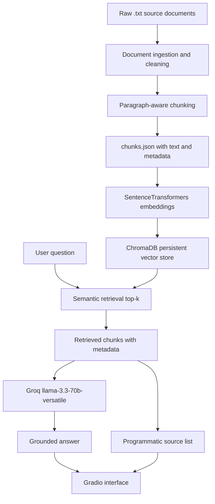

# The Unofficial Guide: YU Student-Life RAG System

## Project Overview

This project is a retrieval-augmented generation (RAG) system that answers questions about Yeshiva University student-life issues using a small local corpus of student newspaper and source documents. It focuses on grounded answers: the system retrieves relevant chunks from the collected documents, sends only those chunks to an LLM, and appends source attribution from chunk metadata.

The current corpus contains 10 YU student-life documents and 137 processed chunks. The system is intended for questions about dining, meal plans, cafeteria costs, administrative responses, bureaucracy, and CS student community experiences. It is not a general YU policy search engine.

## Domain

The domain is an unofficial guide to Yeshiva University student life, focused on dining, meal plans, housing and cafeteria costs, bureaucracy, and CS student community experiences.

This knowledge is valuable because it reflects student-facing experiences that may not appear in official university pages. The corpus is mostly student newspaper reporting and opinion, so it can help answer practical questions about how students describe policies, costs, administrative responses, and community support.

## Document Sources

| # | Source file | Title | URL | Topic |
|---|---|---|---|---|
| 1 | `data/raw/01_meal_plan_or_meal_scam.txt` | Meal Plan or Meal Scam? | https://yuobserver.org/2017/09/meal-plan-meal-scam/ | Meal plans, dining costs, student complaints |
| 2 | `data/raw/02_students_are_hungry_meal_plan.txt` | Students are Hungry: A Call for YU to Alter the New Meal Plan | https://yuobserver.org/2019/10/students-are-hungry-a-call-for-yu-to-alter-the-new-meal-plan/ | Meal plan changes, affordability, student criticism |
| 3 | `data/raw/03_no_money_no_food_meal_plan.txt` | No Money, No Food: How YU's New Meal Plan is Harming Students | https://yucommentator.org/2019/11/students-are-infuriated-as-new-meal-plans-leaves-them-without-money-or-food/ | Meal plan structure, student frustration, food access |
| 4 | `data/raw/04_beren_cafeteria_concerns.txt` | Cafeteria Concerns: A Look at Dining on the Beren Campus | https://yuobserver.org/2024/05/cafeteria-concerns-a-look-at-dining-on-the-beren-campus/ | Beren Campus dining, cafeteria pricing, food availability |
| 5 | `data/raw/05_housing_cafeteria_rates.txt` | Housing and Cafeteria Rates Rise on Beren and Wilf Campuses | https://yucommentator.org/2022/07/housing-and-cafeteria-rates-rise-on-beren-and-wilf-campuses/ | Housing rates, cafeteria rates, campus costs |
| 6 | `data/raw/06_sharing_is_caring_caf_policies.txt` | Sharing Is Caring? An Inquiry into YU's Caf Policies, Part I | https://yucommentator.org/2025/04/sharing-is-caring-an-inquiry-into-yus-caf-policies-part-i/ | Cafeteria policies, meal sharing, meal plan rules |
| 7 | `data/raw/07_new_dining_plan_fees_info_session.txt` | University Plans Info Session Regarding New Dining Plan Fees | https://yucommentator.org/2019/11/university-plans-info-session-regarding-new-dining-plan-fees/ | Dining plan fees, university response, student concerns |
| 8 | `data/raw/08_meal_plan_town_halls.txt` | Administration Admits Failure at Meal Plan Town Halls | https://yucommentator.org/2019/11/administration-admits-failure-at-meal-plan-town-halls/ | Meal plan town halls, administrative response, student criticism |
| 9 | `data/raw/09_yu_bureaucracy.txt` | Disorganization at its Core: YU Bureaucracy | https://yuobserver.org/2024/02/disorganization-at-its-core-yu-bureaucracy/ | University bureaucracy, advising, administrative disorganization |
| 10 | `data/raw/10_creation_of_a_community_cs.txt` | The Creation of a Community | https://yuobserver.org/2021/12/the-creation-of-a-community/ | CS student community, workload, imposter syndrome, support |

## Architecture



## Chunking Strategy

The system uses paragraph-aware chunking with a target size of about 700 characters and about 100 characters of overlap. The ingestion code keeps paragraphs together where possible, adds paragraphs to a chunk until the target size is reached, and then starts the next chunk with overlap from the previous chunk.

This is structure-aware chunking, not full semantic chunking. It does not use an LLM or topic model to decide boundaries. The goal is simpler: preserve article paragraph structure so quotes, complaints, and explanations are less likely to be separated by fixed character cuts.

Final processed output: `data/processed/chunks.json` with 137 chunks.

## Sample Chunks

**Sample 1**

- Source document: `01_meal_plan_or_meal_scam.txt`
- Chunk ID: `01_meal_plan_or_meal_scam__chunk_000`
- Text excerpt: Last year, as I was preparing to begin my first year on the Beren Campus, I was nervous about many aspects of college life. When it was time for me to sign up for the Stern College housing and meal plan, I had concerns only about the residence aspect...

**Sample 2**

- Source document: `02_students_are_hungry_meal_plan.txt`
- Chunk ID: `02_students_are_hungry_meal_plan__chunk_005`
- Text excerpt: The supposed benefit is that the food at caf stores and cafeterias will not be taxed and will be discounted by 35-40%. Given this new balance of $825, I wanted to gauge if this amount was indeed sufficient for an entire semester's worth of food purchases...

**Sample 3**

- Source document: `04_beren_cafeteria_concerns.txt`
- Chunk ID: `04_beren_cafeteria_concerns__chunk_002`
- Text excerpt: Aside from the flooding, issues such as food quality and pricing make eating in the cafeterias a constant difficulty for students. "We are not getting enough bang for our buck," said senior Rae Eisenstein...

**Sample 4**

- Source document: `08_meal_plan_town_halls.txt`
- Chunk ID: `08_meal_plan_town_halls__chunk_002`
- Text excerpt: Also in attendance at Wilf were Cohen; Rabbi Josh Weisberg, Senior Director of Student Life and Samuel Chasan, Director of Dining Services. From the outset of his presentation, Schwab stated...

**Sample 5**

- Source document: `09_yu_bureaucracy.txt`
- Chunk ID: `09_yu_bureaucracy__chunk_017`
- Text excerpt: They said I couldn't be any science major other than sociology, so now I am a sociology major with a bio minor because I am not allowed to be a bio major...

## Embedding Model and Vector Store

The embedding model is `all-MiniLM-L6-v2` from `sentence-transformers`. Embeddings are generated locally and stored in a persistent ChromaDB collection named `unofficial_guide_chunks`.

This model is a practical fit for the project because it is local, free to run, fast enough for 137 chunks, and does not require an embedding API key. For production use, I would revisit the tradeoffs:

- Cost: local embeddings avoid API cost, while hosted embedding models may charge per token.
- Latency: local embeddings are fast for a small corpus, but hosted models can be faster or easier to scale with managed infrastructure.
- Accuracy: larger or newer embedding models may retrieve better matches for broad or multi-topic questions.
- Multilingual support: `all-MiniLM-L6-v2` is not the best choice for multilingual retrieval.
- Context length: larger chunks or longer documents may require a model better at long-context semantic matching.
- Local vs API: local embeddings improve privacy and reproducibility, while API embeddings can improve quality and reduce local setup friction.

## Retrieval Test Results

**Query:** What are the most common student complaints about YU meal plans?

Top returned chunk titles:

- Students are Hungry: A Call for YU to Alter the New Meal Plan
- Housing and Cafeteria Rates Rise on Beren and Wilf Campuses
- No Money, No Food: How YU's New Meal Plan is Harming Students
- University Plans Info Session Regarding New Dining Plan Fees

Why relevant: the first and third chunks directly discuss student complaints about meal-plan affordability and food access. The housing/cafeteria rates and dining-fee info-session chunks add cost and university-response context.

**Query:** What differences appear between Beren and Wilf campus dining or cost concerns?

Top returned chunk titles:

- Cafeteria Concerns: A Look at Dining on the Beren Campus
- Housing and Cafeteria Rates Rise on Beren and Wilf Campuses
- Cafeteria Concerns: A Look at Dining on the Beren Campus
- Cafeteria Concerns: A Look at Dining on the Beren Campus

Why relevant: the Beren cafeteria article directly describes Beren-specific food options, pricing, and availability. The rates article is relevant because it compares cost changes across Beren and Wilf.

**Query:** How did YU administration respond to criticism about dining plans and fees?

Top returned chunk titles:

- Students are Hungry: A Call for YU to Alter the New Meal Plan
- No Money, No Food: How YU's New Meal Plan is Harming Students
- Administration Admits Failure at Meal Plan Town Halls
- Sharing Is Caring? An Inquiry into YU's Caf Policies, Part I

Why relevant: the town-hall article directly covers administrative explanations and admissions. The meal-plan criticism articles provide the student concerns that prompted those responses.

## Grounded Generation

Generation uses Groq's hosted `llama-3.3-70b-versatile` model. The generator loads `GROQ_API_KEY` from `.env` with `python-dotenv`.

The prompt instructs the model to:

- answer only using the provided context
- not use outside knowledge
- say exactly `I don't have enough information from the provided documents to answer that.` when the context is insufficient
- not invent facts, numbers, sources, or policies
- be concise but specific

Source attribution is guaranteed programmatically. The generator deduplicates retrieved chunk metadata by `(title, source_url)` and returns a `sources` list even if the LLM does not cite sources in the answer text. The Gradio app displays those sources separately.

The generator also includes a conservative low-relevance guard. If all retrieved chunks have weak cosine-distance scores, it refuses instead of sending unrelated context to the LLM.

## Query Interface

The query interface is a Gradio app in `app.py`. It includes:

- a textbox labeled `Ask a question`
- a top-k retrieval slider from 2 to 8, default 4
- an answer textbox
- a source attribution area
- a retrieved-chunk debug area with source titles, URLs, chunk indices, previews, and distance scores
- example questions, including an intentionally out-of-scope parking question

## Example Responses

**In-scope example 1**

Question: What are the most common student complaints about YU meal plans?

Answer: The most common student complaints about YU meal plans are that they are overpriced, with students having to worry about affording food for the day, and that the university requires all students living on campus to be on a meal plan, unlike other colleges that only require freshmen to do so. Students are also concerned about having to skip meals due to the high costs.

Sources:

- Students are Hungry: A Call for YU to Alter the New Meal Plan - https://yuobserver.org/2019/10/students-are-hungry-a-call-for-yu-to-alter-the-new-meal-plan/
- Housing and Cafeteria Rates Rise on Beren and Wilf Campuses - https://yucommentator.org/2022/07/housing-and-cafeteria-rates-rise-on-beren-and-wilf-campuses/
- No Money, No Food: How YU's New Meal Plan is Harming Students - https://yucommentator.org/2019/11/students-are-infuriated-as-new-meal-plans-leaves-them-without-money-or-food/
- University Plans Info Session Regarding New Dining Plan Fees - https://yucommentator.org/2019/11/university-plans-info-session-regarding-new-dining-plan-fees/

**In-scope example 2**

Question: What differences appear between Beren and Wilf campus dining or cost concerns?

Answer: The differences between Beren and Wilf campus dining include the variety of food options, with Wilf having a grill and a proper grocery store, while Beren has a pasta bar with limited options. Additionally, Wilf has supplemental dining options such as The Food Court and Nagel Bagel, which offer grocery items, snacks, drinks, sandwiches, and salads, whereas Beren's equivalent, Milner's Mart, mostly offers packaged snacks with no fresh meal options. In terms of cost concerns, both campuses experienced a 10% rise in cafeteria price plans.

Sources:

- Cafeteria Concerns: A Look at Dining on the Beren Campus - https://yuobserver.org/2024/05/cafeteria-concerns-a-look-at-dining-on-the-beren-campus/
- Housing and Cafeteria Rates Rise on Beren and Wilf Campuses - https://yucommentator.org/2022/07/housing-and-cafeteria-rates-rise-on-beren-and-wilf-campuses/

**Out-of-scope example**

Question: What parking options are available for graduate students?

Answer: I don't have enough information from the provided documents to answer that.

Retrieved sources were weakly related dining and housing-cost chunks, so the system refused instead of inventing graduate parking policy.

## Evaluation Report

Evaluation was run with `uv run python scripts/evaluate_milestone6.py`. Raw outputs were saved to `docs/milestone6_evaluation_outputs.json`.

| Question | Expected answer | System response summary | Retrieved source titles | Judgment | Notes |
|---|---|---|---|---|---|
| What are the most common student complaints about YU meal plans? | High costs, restrictive or mandatory plans, poor value, confusing fees, limited flexibility, and food-access concerns. | Answered that plans were overpriced, mandatory for on-campus students, and caused concern about affording food or skipping meals. | Students are Hungry; Housing and Cafeteria Rates Rise; No Money, No Food; University Plans Info Session | Accurate | Supported by retrieved dining-cost and meal-plan criticism chunks. |
| How did dining costs and meal plan rules affect food access for students? | Students struggled with balances, skipped or rationed meals, and were limited by rules about where/how funds could be used. | Answered that $11/day was insufficient, discounts did not offset costs, no-sharing rules limited access, and out-of-town students were disadvantaged. | Students are Hungry; Meal Plan or Meal Scam?; Administration Admits Failure at Meal Plan Town Halls; Sharing Is Caring? | Accurate | The answer stayed within retrieved meal-plan and caf-policy context. |
| What differences appear between Beren and Wilf campus dining or cost concerns? | Compare Beren cafeteria pricing/availability, Wilf/Beren rate increases, and campus-specific food options. | Compared Wilf's grill, grocery store, Food Court, and Nagel Bagel with Beren's pasta bar and Milner's Mart; also mentioned cafeteria price-plan increases. | Cafeteria Concerns; Housing and Cafeteria Rates Rise; Cafeteria Concerns; Cafeteria Concerns | Accurate | Retrieved chunks were concentrated but relevant to Beren/Wilf dining and costs. |
| How did YU administration respond to criticism about dining plans and fees? | Mention info sessions, town halls, cost explanations, and admissions or acknowledgments of failure/concerns. | Answered that administration would review material with Dining Services and that town-hall administrators explained overhead costs. | Students are Hungry; No Money, No Food; Administration Admits Failure at Meal Plan Town Halls; Sharing Is Caring? | Accurate | The town-hall source directly supported the administrative-response portion. |
| What non-dining student experience issues appear in the source set, such as community support? | Identify bureaucracy/administrative disorganization and CS community support, workload, belonging, or imposter syndrome. | Answered mostly about tuition affordability, meal-plan well-being, transparency, and communication. | University Plans Info Session; Students are Hungry; Students are Hungry; University Plans Info Session | Partially accurate | Retrieval missed the bureaucracy and CS community documents, so generation answered from dining/admin-fee chunks. |
| What parking options are available for graduate students? | Refuse because the corpus does not contain graduate parking information. | Refused with the standard insufficient-context response. | Housing and Cafeteria Rates Rise; Sharing Is Caring?; Cafeteria Concerns; Meal Plan or Meal Scam? | Accurate | The low-relevance retrieval guard prevented a hallucinated parking answer. |

## Failure Case

The clearest failure case was the fifth evaluation question:

Question: What non-dining student experience issues appear in the source set, such as community support?

The expected answer should have discussed bureaucracy and CS community support, including workload, belonging, and imposter syndrome. Instead, retrieval returned dining and dining-fee documents:

- University Plans Info Session Regarding New Dining Plan Fees
- Students are Hungry: A Call for YU to Alter the New Meal Plan
- Students are Hungry: A Call for YU to Alter the New Meal Plan
- University Plans Info Session Regarding New Dining Plan Fees

The model's answer was partially accurate because it discussed administrative communication and student well-being, but it missed the intended non-dining documents. The root cause was retrieval, not generation: the query was broad and included terms like "student experience" and "support," while the corpus is dominated by dining-related chunks. The top-k search did not retrieve `Disorganization at its Core: YU Bureaucracy` or `The Creation of a Community`, so the LLM did not have enough context to answer the full question.

To fix this, I would add query rewriting or multi-query retrieval for broad questions, increase `k` for synthesis questions, and consider metadata/topic filtering when the user explicitly asks for non-dining issues.

## Spec Reflection

The planning document helped guide implementation by defining the domain, source list, chunking approach, retrieval model, and evaluation questions before coding. That made it easier to keep Milestones 3-5 aligned: the ingestion pipeline preserved metadata, the vector store kept source titles and URLs, and the generator returned source attribution because the spec identified attribution as an evaluation requirement.

The implementation diverged from the original spec by adding a low-relevance refusal guard in the generator. The planning document said the app should refuse when context is insufficient, but it did not specify a distance threshold. During testing, the out-of-scope parking query retrieved weakly related dining chunks with much higher distances than in-scope questions, so I added a conservative threshold to avoid passing irrelevant context to the LLM.

## AI Usage

**Instance 1**

- What I gave the AI: the planning document sections on domain, documents, architecture, and chunking strategy.
- What it produced: document ingestion and chunking code that reads local `.txt` files, separates metadata, cleans text, and writes chunk dictionaries to `data/processed/chunks.json`.
- What I changed or overrode: I reviewed and adjusted the implementation to preserve paragraph boundaries, keep source metadata on every chunk, and use the planned target of about 700 characters with about 100 characters of overlap.

**Instance 2**

- What I gave the AI: the retrieval approach, generation/interface requirements, and Milestone 5 stack requirements.
- What it produced: ChromaDB retrieval scaffolding, Groq grounded generation code, and a Gradio interface.
- What I changed or overrode: I validated outputs using real retrieval results, added programmatic source attribution instead of relying on the LLM to cite, and added a low-relevance refusal guard for out-of-scope questions.

## How to Run

Install dependencies with `uv`:

```powershell
uv sync
```

Create a `.env` file with:

```text
GROQ_API_KEY=your_groq_api_key_here
```

Run the document pipeline:

```powershell
uv run python scripts\run_pipeline.py
```

Build the ChromaDB vector store:

```powershell
uv run python scripts\build_vector_store.py
```

Test retrieval:

```powershell
uv run python scripts\test_retrieval.py
```

Run Milestone 5 validation:

```powershell
uv run python scripts\validate_milestone5.py
```

Run Milestone 6 evaluation:

```powershell
uv run python scripts\evaluate_milestone6.py
```

Launch the Gradio app:

```powershell
uv run python app.py
```

## Demo Video

Demo video link: [https://www.loom.com/share/6e5d2a57a860412d858eb73c1644ec0d]
